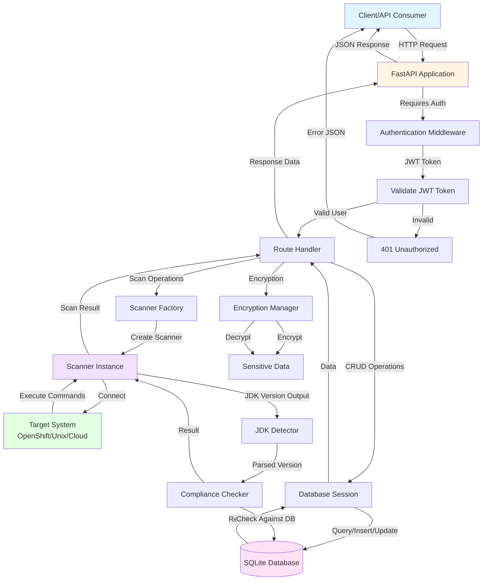
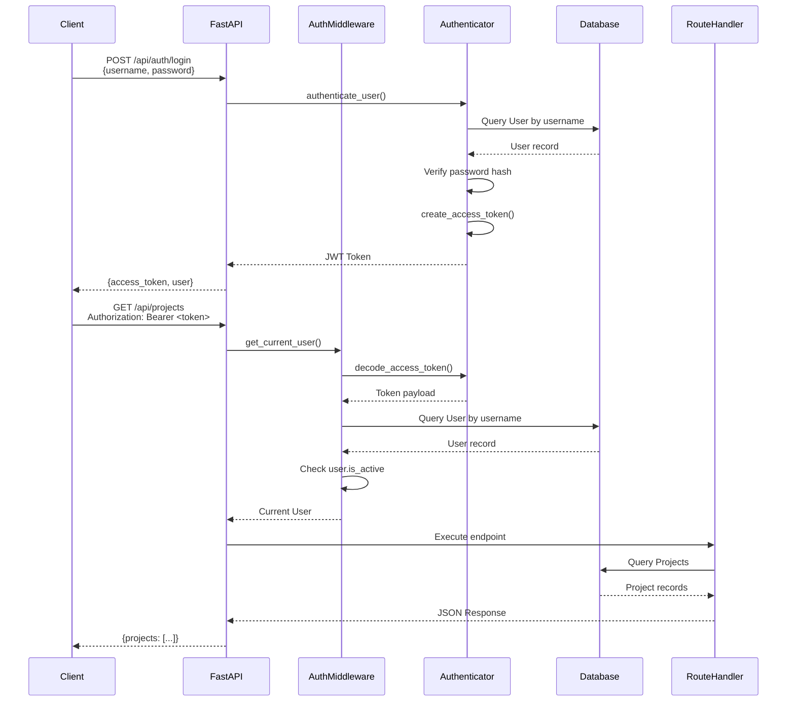
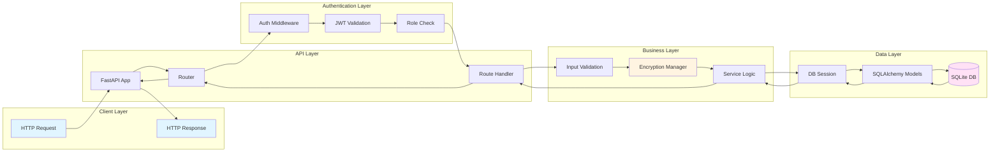
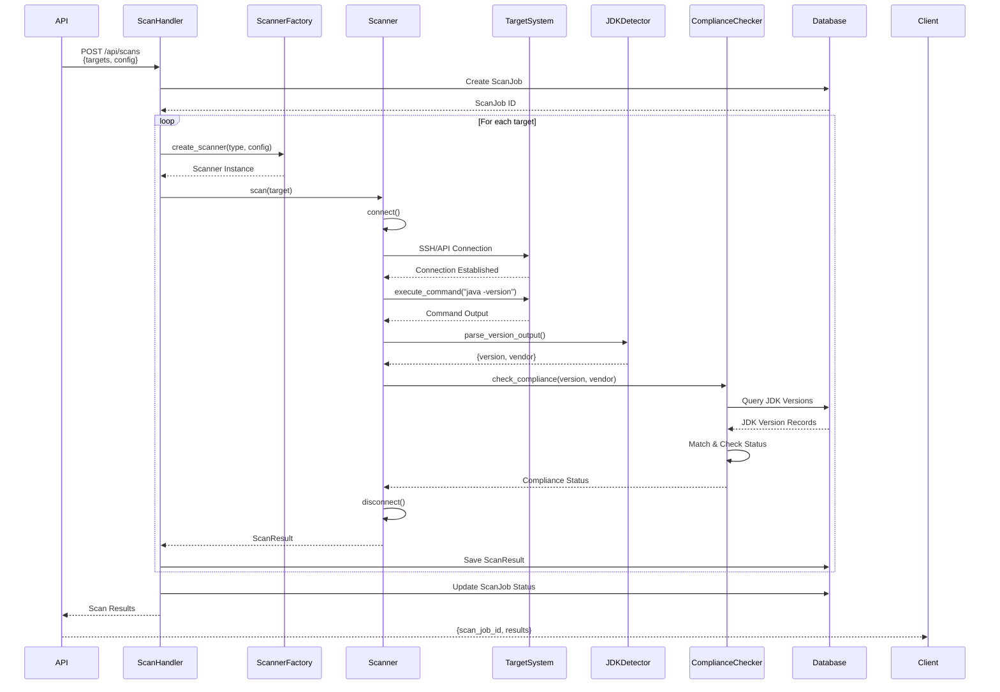
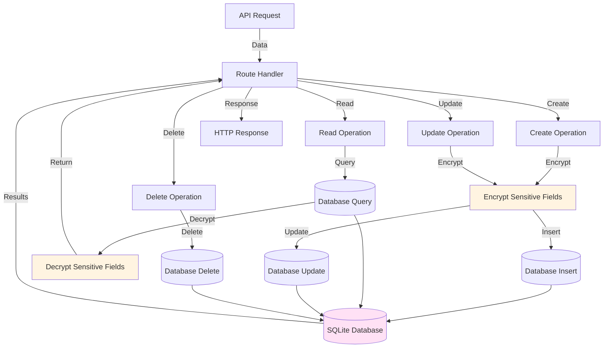
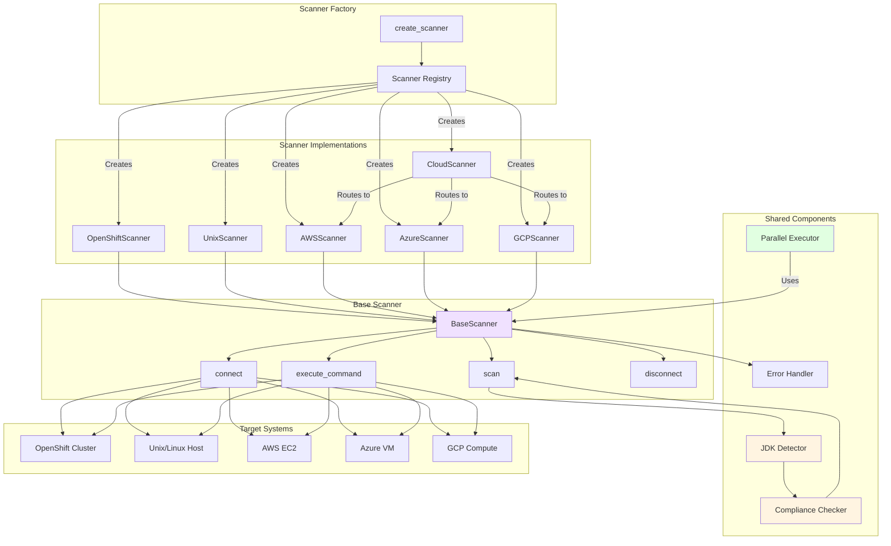
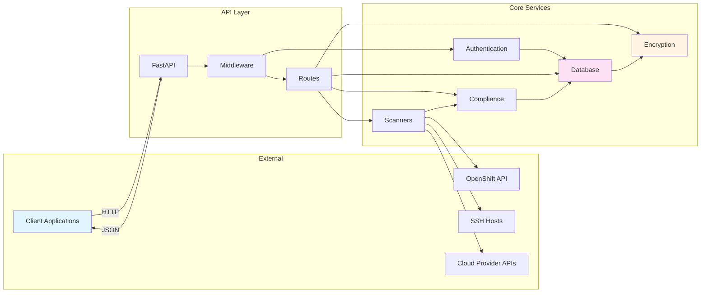
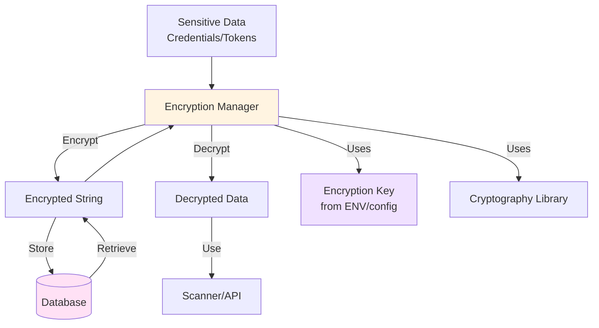

# Backend Dataflow Diagram

This document illustrates the dataflow through the JDK Compliance Scanner backend system.

## High-Level Dataflow

## Authentication Flow

## API Request Flow (CRUD Operations)

## Scanning Flow

## Database Operations Flow

## Scanner Architecture Flow

## Component Interactions

## Data Encryption Flow

## Notes

### Key Components

1. **FastAPI Application**: Entry point for all HTTP requests
2. **Authentication Middleware**: Validates JWT tokens and enforces role-based access
3. **Route Handlers**: Process specific API endpoints (clusters, projects, targets, etc.)
4. **Database Layer**: SQLAlchemy ORM with SQLite database
5. **Encryption Manager**: Handles encryption/decryption of sensitive data
6. **Scanner Factory**: Creates appropriate scanner instances based on deployment type
7. **Scanners**: Connect to target systems and execute JDK version detection
8. **JDK Detector**: Parses `java -version` output to extract version and vendor
9. **Compliance Checker**: Validates JDK versions against database compliance rules

### Data Flow Patterns

- **Request Flow**: Client → FastAPI → Auth → Route Handler → Database/Scanner → Response
- **Authentication**: Token validation happens before route handlers execute
- **Encryption**: Sensitive data encrypted before storage, decrypted when retrieved
- **Scanning**: Factory creates scanner → Scanner connects → Executes commands → Parses output → Checks compliance → Returns results
- **Error Handling**: Centralized error handler logs errors at each layer

### Security Considerations

- All credentials stored encrypted in database
- JWT tokens validated on every authenticated request
- Role-based access control enforced by middleware
- Sensitive fields decrypted only when needed for operations
- Connection credentials encrypted before storage

