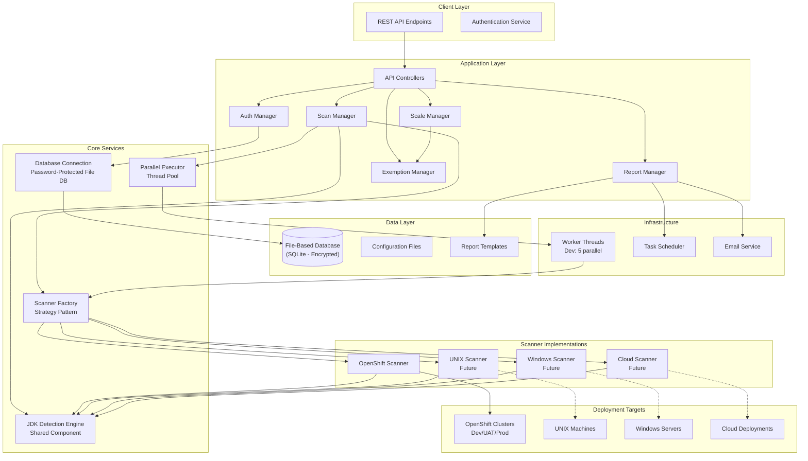

# JDK Compliance Scanner Implementation Plan

## Overview

A web-based REST API application for monitoring and enforcing JDK compliance across multiple deployment types (OpenShift clusters, UNIX machines, Windows servers, Cloud deployments, etc.). The application uses an extensible scanner architecture (Strategy pattern) to scan different deployment types, identifies Java versions, checks compliance against a database, scales down non-compliant applications (unless exempted), and generates comprehensive reports. The design follows DRY, SOLID, and KISS principles for maintainability and extensibility.

## Architecture Overview

## Data Requirements and Onboarding Process

### Project/Namespace Onboarding Prerequisites

Before a project/namespace can be scanned by the application, an **Administrator must onboard** it with the following **REQUIRED** fields:

#### Required Onboarding Fields

1. **project_name** (String, Required, Unique)

- Project/Namespace name in OpenShift cluster
- Must match exactly as it appears in OpenShift

2. **cluster_id** (Foreign Key, Required)

- Reference to the cluster where this project exists
- Cluster must be registered first

3. **technology** (String, Required)

- Technology stack used in the project
- Examples: Java, Python, Node, Go, Mixed
- Used for filtering and reporting

4. **tribe** (String, Required)

- Organizational tribe/team that owns the project
- Used for organizational reporting and ownership

5. **cluster_name** (String, Required)

- Name of the OpenShift cluster
- Should match cluster record but stored here for quick reference

6. **console_url** (String, Required)

- OpenShift console URL for this project/namespace
- Format: `https://console-openshift-console.apps.<cluster-domain>/k8s/cluster/projects/<project-name>`

7. **tier** (String, Required)

- Environment tier classification
- Values: Dev, UAT, Production
- Determines scanning strategy and urgency

8. **retired** (Boolean, Required, Default: False)

- Indicates if project is retired/archived
- Retired projects are excluded from active scans

9. **techReadToken** (String, Required, Encrypted)

- OpenShift token for read-only operations (scanning)
- Used for `oc login` with read permissions
- Must be encrypted at rest using application-level encryption
- Format: OpenShift service account token or user token

10. **techEditcredentials** (String, Required, Encrypted)

    - Credentials for edit/write operations (scaling, etc.)
    - Can be token or username:password format
    - Must be encrypted at rest
    - Used for operations that modify resources (e.g., scaling down)

11. **WrapperClusterToken** (String, Required, Encrypted)

    - Special wrapper cluster token for specific operations
    - Used for cluster-level operations that require elevated permissions
    - Must be encrypted at rest

#### Onboarding Workflow

1. **Administrator logs in** with Administrator role
2. **Cluster must exist** in system (or administrator creates it first)
3. **Administrator creates project** via `POST /api/projects` with all required fields
4. **System validates** all required fields are present
5. **System encrypts** all tokens/credentials before storing
6. **Project status** set to 'Active' if all validations pass
7. **Project is now ready** for scanning operations

#### Field Validation Rules

- All fields are **required** - missing any field will result in validation error
- `project_name` must be unique per cluster
- `techReadToken` must be valid OpenShift token format
- `console_url` must be valid URL format
- `tier` must be one of: Dev, UAT, Production
- `technology` should be from allowed list (configurable)
- Cluster referenced by `cluster_id` must exist and be active

#### Security Considerations

- All tokens and credentials are encrypted using application-level encryption (AES-256)
- Encryption keys managed separately from database encryption
- Credentials are decrypted only when needed for operations
- Credentials never logged or exposed in API responses
- Audit trail maintained for all credential updates

## Core Components

### 1. Database Schema (File-Based - SQLite with Password Protection)

- **File Location**: Local file database (e.g., `data/compliance.db` or configurable path)
- **Password Protection**: Database encrypted with password that is merged but not available to application at runtime
- **Tables**:
- **deployment_types**: Store supported deployment types (OpenShift, UNIX, Windows, Cloud, etc.) with metadata
- **clusters**: Store cluster information
- `id` (Primary Key)
- `cluster_name` (String, Unique) - Name of the OpenShift cluster
- `console_url` (String) - OpenShift console URL
- `api_url` (String) - OpenShift API URL
- `environment` (String) - Dev/UAT/Production
- `created_at` (DateTime)
- `updated_at` (DateTime)

- **projects** (or **namespaces**): Store project/namespace onboarding information (REQUIRED before scanning)
- `id` (Primary Key)
- `project_name` (String, Unique) - Project/Namespace name in OpenShift
- `cluster_id` (Foreign Key -> clusters.id) - Reference to cluster
- `technology` (String) - Technology stack (Java, Python, Node, Go, etc.)
- `tribe` (String) - Organizational tribe/team ownership
- `tier` (String) - Environment tier (Dev, UAT, Production)
- `retired` (Boolean, Default: False) - Whether project is retired/archived
- `console_url` (String) - Project-specific console URL
- `tech_read_token` (String, Encrypted) - Read-only token for scanning (OC login token)
- `tech_edit_credentials` (String, Encrypted) - Edit credentials (username/password or token for write operations)
- `wrapper_cluster_token` (String, Encrypted) - Wrapper cluster token for special operations
- `onboarded_by` (Foreign Key -> users.id) - Administrator who onboarded this project
- `onboarded_at` (DateTime) - Timestamp when project was onboarded
- `created_at` (DateTime)
- `updated_at` (DateTime)
- `status` (String) - Active, Inactive, Retired
- **Note**: All fields are REQUIRED and must be provided by administrator before project can be scanned

- **jdk_versions**: JDK major versions (8, 11, 17, 18, 19, 21, 22), vendor (Zulu/Oracle/Amazon), compliance status
- `id` (Primary Key)
- `major_version` (Integer) - JDK major version (8, 11, 17, 18, 19, 21, 22)
- `vendor` (String) - Vendor name (Zulu, Oracle, Amazon, etc.)
- `compliance_status` (String) - Compliant, Non-Compliant, CompliantStar
- `is_active` (Boolean) - Whether version is currently tracked
- `created_at` (DateTime)
- `updated_at` (DateTime)

- **exemptions**: Project, application, JDK version, reason, dates, status, type, created_by (immutable)
- `id` (Primary Key)
- `project_id` (Foreign Key -> projects.id)
- `application_name` (String) - Application/deployment name
- `jdk_version_id` (Foreign Key -> jdk_versions.id)
- `exemption_reason` (Text) - Reason for exemption
- `start_date` (Date)
- `end_date` (Date, Nullable) - Null for indefinite exemptions
- `exemption_status` (String) - Active, Expired, Revoked
- `exemption_type` (String) - Temporary, Permanent, etc.
- `created_by` (Foreign Key -> users.id)
- `created_at` (DateTime) - Immutable after creation

- **scan_results**: Historical scan data with JDK findings, deployment type, target information
- `id` (Primary Key)
- `project_id` (Foreign Key -> projects.id)
- `cluster_id` (Foreign Key -> clusters.id)
- `scan_job_id` (String) - Reference to scan job
- `application_name` (String)
- `pod_name` (String, Nullable)
- `detected_jdk_version` (String, Nullable)
- `detected_jdk_vendor` (String, Nullable)
- `compliance_status` (String) - Compliant, Non-Compliant, Exempted, Not Found
- `jdk_found` (Boolean)
- `scan_timestamp` (DateTime)
- `error_message` (Text, Nullable) - If scan failed
- `raw_output` (Text, Nullable) - Raw java -version output

- **scan_jobs**: Track scan execution jobs
- `id` (Primary Key, UUID)
- `job_type` (String) - Manual, Scheduled, Triggered
- `status` (String) - Pending, Running, Completed, Failed
- `initiated_by` (Foreign Key -> users.id)
- `started_at` (DateTime, Nullable)
- `completed_at` (DateTime, Nullable)
- `total_targets` (Integer)
- `targets_scanned` (Integer)
- `targets_failed` (Integer)

- **users**: Authentication with encrypted passwords
- `id` (Primary Key)
- `username` (String, Unique)
- `email` (String, Unique)
- `password_hash` (String) - Encrypted password
- `role` (String) - Administrator, Viewer, Operator
- `is_active` (Boolean)
- `created_at` (DateTime)
- `last_login` (DateTime, Nullable)

- **configurations**: System settings (parallel thread count, scan modes, scanner plugins, etc.)
- `id` (Primary Key)
- `key` (String, Unique) - Configuration key
- `value` (String) - Configuration value (JSON for complex values)
- `description` (Text) - Description of configuration
- `updated_at` (DateTime)

- **Connection Handling**: Password must be provided externally (env var, config file, or passed at startup) and used to decrypt/access database
- **Token/Credential Storage**: All tokens and credentials in projects table must be encrypted at rest using application-level encryption (separate from database encryption)

### 2. Authentication Module (`auth/`)

- Token-based authentication (JWT)
- Username/password login endpoint
- Extensible architecture for SSO (future)
- Token validation middleware
- Password encryption handling (database file password merged but not available to app at runtime - must be provided externally)

### 3. Scanner Architecture (`scanner/`) - DRY, SOLID, KISS Compliant

- **BaseScanner** (Abstract Base Class): Defines common interface for all scanners
- `scan(target, config)` - Abstract method for scanning targets
- `connect(target_config)` - Abstract method for establishing connection
- `execute_command(command)` - Abstract method for command execution
- `detect_jdk()` - Shared method using JDKDetector (DRY principle)
- `handle_errors()` - Shared error handling (DRY principle)

- **ScannerFactory** (Factory Pattern): Creates appropriate scanner based on deployment type
- Registers scanner implementations
- Returns correct scanner instance for deployment type
- Follows Open/Closed Principle (SOLID) - open for extension, closed for modification

- **Scanner Implementations** (Strategy Pattern):
- **OpenShiftScanner**: Extends BaseScanner for OpenShift pods
    - Uses OC API for pod exec
    - Retrieves project onboarding data from database
    - Uses `techReadToken` for OC login and read operations
    - Uses `techEditcredentials` for scaling/write operations
    - Uses cluster information (cluster_name, console_url) for connection
    - Environment-specific connections based on `tier` field (Dev/UAT/Prod)
    - Respects `retired` flag - skips retired projects
- **UnixScanner** (Future): Extends BaseScanner for UNIX machines
    - Uses SSH for remote command execution
- **WindowsScanner** (Future): Extends BaseScanner for Windows servers
    - Uses WinRM or SSH for remote command execution
- **CloudScanner** (Future): Extends BaseScanner for cloud deployments
    - Supports AWS, Azure, GCP APIs

- **Shared Components** (DRY Principle):
- **JDKDetector**: Common JDK version parsing (used by all scanners)
- **FallbackDetector**: Secondary command to confirm no Java (shared logic)
- **ConnectionManager**: Handles different connection types (OpenShift API, SSH, WinRM, Cloud APIs)
- **ErrorHandler**: Centralized error logging with deployment type context

- **ParallelExecutor**: Thread pool manager (works with any scanner type)
- **ScanStrategies**: Parallel, Sequential, Round-robin modes (scanner-agnostic)

### 4. JDK Detection & Compliance (`compliance/`)

- **JDKDetector**: Parse `java -version` output for different vendors (Zulu/Oracle/Amazon)
- **ComplianceChecker**: Compare detected version against database
- **StatusManager**: Update compliance status (Compliant, Non-Compliant, CompliantStar, Exempted, Not Found)

### 5. Exemption Management (`exemptions/`)

- CRUD API for exemptions (create only - immutable after creation)
- Filtering by all fields (Project, Application, JDK Version, Reason, Dates, Status, Type, Created By)
- Sorting by all fields
- Export to CSV/JSON/PDF
- Import from CSV/JSON

### 6. Scaling Manager (`scaling/`)

- Check exemptions before scaling
- Scale down non-exempted non-compliant applications
- **OpenShift**: Support Deployments, StatefulSets, DaemonSets
- **Other Platforms**: Extensible for platform-specific scaling (e.g., service stop/restart for UNIX/Windows)
- Log all scaling actions
- Uses Strategy pattern for platform-specific scaling operations (follows SOLID principles)

### 7. Reporting Engine (`reporting/`)

- HTML report generation with configurable templates
- Export formats: JSON, PDF, Excel
- Scheduled reports: Daily, Weekly, Monthly, Yearly, Custom
- Async execution in separate thread
- Email delivery with attachments
- Stakeholder email lists (individuals and groups)

### 8. API Endpoints (`api/`)

#### Authentication

- `POST /api/auth/login` - Username/password authentication
- `POST /api/auth/logout` - Logout (invalidate token)
- `GET /api/auth/validate` - Validate current token

#### Cluster Management (Administrator only)

- `GET /api/clusters` - List all clusters
- `POST /api/clusters` - Create new cluster (Administrator)
- `GET /api/clusters/{id}` - Get cluster details
- `PUT /api/clusters/{id}` - Update cluster (Administrator)
- `DELETE /api/clusters/{id}` - Delete cluster (Administrator)

#### Project/Namespace Onboarding (Administrator only)

- `GET /api/projects` - List all projects/namespaces
- Query params: `cluster_id`, `tribe`, `technology`, `tier`, `retired`, `status`
- Supports pagination and filtering
- `POST /api/projects` - Onboard new project/namespace (Administrator)
- **Required fields**: project_name, cluster_id, technology, tribe, cluster_name, console_url, tier, retired, techReadToken, techEditcredentials, WrapperClusterToken
- Validates all required fields before creation
- Encrypts tokens/credentials before storage
- `GET /api/projects/{id}` - Get project details
- `PUT /api/projects/{id}` - Update project (Administrator)
- Cannot update tokens/credentials directly - use separate endpoint
- `PUT /api/projects/{id}/credentials` - Update credentials/tokens (Administrator)
- `DELETE /api/projects/{id}` - Retire/delete project (Administrator)
- Soft delete: sets status to 'Retired' and retired=true
- `POST /api/projects/{id}/activate` - Reactivate retired project (Administrator)
- `GET /api/projects/{id}/validation` - Validate project onboarding completeness

#### Scanning

- `POST /api/scans` - Trigger scan
- Body: `project_ids` (array), `cluster_id`, or scan all active projects
- `GET /api/scans` - List scan jobs (with filters)
- `GET /api/scans/{id}` - Get scan job details and results
- `GET /api/scans/{id}/results` - Get scan results for a job
- `DELETE /api/scans/{id}` - Cancel running scan job

#### JDK Versions Management

- `GET /api/jdk-versions` - List all JDK versions
- `POST /api/jdk-versions` - Add new JDK version (Administrator)
- `PUT /api/jdk-versions/{id}` - Update JDK version compliance status (Administrator)
- `PUT /api/jdk-versions/{id}/compliance-status` - Update compliance status manually (Administrator)

#### Exemptions

- `GET /api/exemptions` - List exemptions (with filters: project, application, jdk_version, status, etc.)
- Supports sorting by all filterable fields
- `POST /api/exemptions` - Create exemption (immutable after creation)
- `GET /api/exemptions/{id}` - Get exemption details
- `GET /api/exemptions/export` - Export exemptions (CSV/JSON/PDF)
- Query params: `format` (csv/json/pdf), `filters` (JSON)
- `POST /api/exemptions/import` - Import exemptions from CSV/JSON

#### Reports

- `GET /api/reports` - List generated reports
- `GET /api/reports/{id}` - Get report details
- `GET /api/reports/{id}/download` - Download report (HTML/PDF/Excel/JSON)
- Query param: `format` (html/pdf/excel/json)
- `POST /api/reports/generate` - Manually generate report
- `POST /api/reports/schedule` - Schedule report (Daily/Weekly/Monthly/Yearly/Custom)
- `GET /api/reports/templates` - List available report templates

## Key Files to Create/Modify

### New Files

- `database/models.py` - SQLAlchemy models for all tables including clusters, projects (with all onboarding fields), jdk_versions, exemptions, scan_results, scan_jobs, users, and configurations
- `database/migrations/` - Alembic migrations (for schema versioning)
- `database/connection.py` - File-based database (SQLite) connection with password handling and encryption
- `database/encryption.py` - Database encryption/decryption utilities for password-protected file database
- `database/credential_encryption.py` - Application-level encryption for project tokens and credentials
- `auth/authenticator.py` - Token generation and validation
- `auth/middleware.py` - Request authentication middleware
- `scanner/base.py` - Abstract BaseScanner class (common interface for all scanners)
- `scanner/factory.py` - ScannerFactory implementing Factory pattern
- `scanner/connection_manager.py` - Shared connection manager for all deployment types (DRY)
- `scanner/openshift_scanner.py` - OpenShiftScanner implementation
- `scanner/unix_scanner.py` - UnixScanner implementation (future)
- `scanner/windows_scanner.py` - WindowsScanner implementation (future)
- `scanner/cloud_scanner.py` - CloudScanner implementation (future)
- `scanner/parallel_executor.py` - Thread pool executor (scanner-agnostic)
- `scanner/scan_strategies.py` - Parallel/Sequential/Round-robin strategies (scanner-agnostic)
- `scanner/error_handler.py` - Centralized error handling (DRY)
- `compliance/jdk_detector.py` - Parse Java version strings
- `compliance/checker.py` - Compliance validation
- `exemptions/manager.py` - Exemption CRUD operations
- `scaling/manager.py` - Application scaling logic
- `reporting/engine.py` - Report generation
- `reporting/templates/` - HTML templates (configurable)
- `reporting/scheduler.py` - Scheduled report execution
- `api/routes/` - REST API route handlers
- `api/routes/clusters.py` - Cluster management endpoints (Administrator)
- `api/routes/projects.py` - Project/namespace onboarding and management endpoints (Administrator)
- `api/routes/scans.py` - Scan execution endpoints
- `api/routes/jdk.py` - JDK version management endpoints
- `api/routes/exemptions.py` - Exemption management endpoints
- `api/routes/reports.py` - Report generation and management endpoints
- `config/settings.py` - Configuration management
- `utils/email_service.py` - Email delivery
- `Dockerfile` - Containerization
- `docker-compose.yml` - MySQL + app orchestration

### Modified Files

- `requirements.txt` - Add SQLite (pysqlcipher3 or sqlcipher3), JWT, PDF generation, Excel export dependencies
- `core/openshift_cluster.py` - Extend for environment-specific operations

## Implementation Phases

### Phase 1: Foundation

1. Database schema design and migrations for file-based database

- Detailed projects table with all required onboarding fields
- Clusters table for cluster information
- Credential encryption setup for tokens

2. File-based database (SQLite) connection setup with password protection and encryption
3. Application-level credential encryption for project tokens (techReadToken, techEditcredentials, WrapperClusterToken)
4. Database password handling (password merged but must be provided externally at runtime)
5. Basic authentication (username/password + JWT tokens) with role-based access (Administrator, Viewer, Operator)
6. REST API structure with token middleware and role-based authorization
7. Project/namespace onboarding API with field validation (Administrator only)

### Phase 2: Extensible Scanner Architecture

5. Abstract BaseScanner class design (SOLID principles)
6. Shared JDK detector component (DRY - reusable across all scanners)
7. ScannerFactory implementation (Factory pattern for extensibility)
8. ConnectionManager for multiple connection types (OpenShift API, SSH, WinRM, Cloud APIs)
9. OpenShiftScanner implementation (first concrete scanner)
10. Centralized error handler (DRY principle)
11. Parallel executor and scan strategies (scanner-agnostic)
12. Fallback scanning for non-Java applications (shared logic)

### Phase 3: Compliance & Exemptions

10. JDK compliance checker
11. Compliance status management API
12. Exemption management (CRUD, filter, sort, export/import)

### Phase 4: Scaling

13. Exemption checking before scaling
14. Application scaling logic (Deployments/StatefulSets/DaemonSets)

### Phase 5: Reporting

15. HTML report generator with templates
16. Export to JSON/PDF/Excel
17. Email delivery service
18. Report scheduler (Daily/Weekly/Monthly/Yearly/Custom)

### Phase 6: Optimization & Deployment

19. Parallel execution for Dev clusters (configurable threads)
20. Scan strategies (Parallel/Sequential/Round-robin)
21. Async reporting in separate threads
22. Docker containerization
23. Configuration management

## Technology Stack

- **Framework**: FastAPI (or Flask/FastAPI hybrid with existing aiohttp)
- **Database**: SQLite (file-based) with SQLCipher for password protection, SQLAlchemy ORM
- **Database Encryption**: pysqlcipher3 or sqlcipher3 for encrypted SQLite databases
- **Authentication**: JWT tokens (PyJWT)
- **Design Patterns**: Strategy (scanners), Factory (scanner creation), Template Method (BaseScanner)
- **OpenShift**: OC API SDK (python-openshift, kubernetes)
- **Remote Access**: paramiko (SSH for UNIX), pywinrm (Windows), boto3/azure-sdk/google-cloud (Cloud)
- **PDF**: ReportLab or WeasyPrint
- **Excel**: openpyxl or pandas
- **Email**: smtplib or aiosmtplib
- **Async**: asyncio, threading for parallel operations
- **Container**: Docker

## Configuration

- Parallel thread count for Dev scans (default: 5, configurable)
- Scanner type selection (OpenShift, UNIX, Windows, Cloud) - extensible via factory
- Scan method per deployment type (OC API, SSH, WinRM, Cloud APIs)
- Scan mode (Parallel/Sequential/Round-robin) - applies to all scanner types
- Report templates directory
- Email SMTP settings
- Database file path (configurable location)
- Database password (must be provided externally via environment variable, config file, or startup parameter - not embedded in application)
- Scanner plugin registration (for adding new deployment types without modifying core code)

## Design Principles Applied

### DRY (Don't Repeat Yourself)

- Shared JDK detection logic used by all scanners
- Centralized error handling and logging
- Common connection management utilities
- Reusable parallel execution framework

### SOLID Principles

- **Single Responsibility**: Each scanner handles one deployment type
- **Open/Closed**: Extensible via BaseScanner (open for extension, closed for modification)
- **Liskov Substitution**: All scanners can be used interchangeably via BaseScanner interface
- **Interface Segregation**: Clean abstract interface with only necessary methods
- **Dependency Inversion**: Scanners depend on BaseScanner abstraction, not concrete implementations

### KISS (Keep It Simple, Stupid)

- Simple Factory pattern for scanner creation
- Clear separation of concerns (scanning, detection, compliance)
- Straightforward plugin registration mechanism