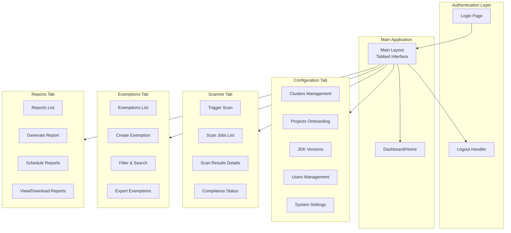

# JDK Compliance Scanner - UI Implementation Plan

## Overview

A clean, professional, responsive web-based user interface for the JDK Compliance Scanner application. The UI provides an intuitive tabbed interface for administrators and operators to manage clusters, onboard projects, trigger scans, view compliance results, manage exemptions, and generate reports.

The design emphasizes simplicity, clarity, and consistency following DRY, KISS, and MISS principles. The interface uses a custom design system with solid colors (no gradients), clean typography, and reusable components for a professional, enterprise-grade appearance.

### Data Model Relationships

**Fabric Structure (OpenShift/Kubernetes)**:
- **Cluster** → **Projects** → **Deployments** → **Pods**
- Projects belong to Clusters (cluster_id foreign key)
- Pods are discovered and scanned through Projects (not managed as separate Targets)

**Standalone Targets**:
- **Unix Targets**: Standalone targets with hostname and credentials (username/password)
- **Windows Targets**: Standalone targets with hostname and credentials (username/password)
- **Cloud Targets**: Placeholder (not implemented in UI)

**Key Points**:
- Projects are only for OpenShift/Kubernetes (fabric structure)
- Targets are only for Unix and Windows (standalone, no project/cluster relationship)
- Cluster data (cluster_name, console_url, api_url) comes from Cluster table
- Projects inherit cluster_name and console_url from selected Cluster (auto-populated)

### Backend API Alignment

This UI plan is verified against the backend implementation. The following APIs are implemented and ready for UI integration:

**Implemented APIs** (Ready for UI):
- Authentication: `/api/auth/*` (login, validate, logout)
- Clusters: `/api/clusters/*` (CRUD operations)
- Projects: `/api/projects/*` (onboarding, management, credentials)
- Targets: `/api/targets/*` (Unix/Cloud target management)
- JDK Versions: `/api/jdk-versions/*` (version management)

**Pending APIs** (Not yet implemented in backend):
- Scans: `/api/scans/*` (trigger, list, results)
- Exemptions: `/api/exemptions/*` (CRUD, export/import)
- Reports: `/api/reports/*` (generate, schedule, download)
- Dashboard: `/api/dashboard/stats` (aggregate statistics)
- Users: `/api/users/*` (user management)
- Configurations: `/api/configurations/*` (system settings)

**Field Naming Convention**: Backend uses **snake_case** for all API field names (e.g., `tech_read_token`, `cluster_id`). UI must use snake_case when sending data to the API.

### Project Structure

The UI is implemented in a separate `ui/` directory at the project root, matching the backend structure:

```
jdk-compliance-scanner/
├── backend/          # Backend API (FastAPI)
├── ui/              # Frontend UI (React + TypeScript)
├── docs/            # Documentation
└── README.md
```

This separation allows independent development, deployment, and maintenance of frontend and backend.

## UI Architecture



## Design Philosophy

The UI follows **DRY (Don't Repeat Yourself)**, **KISS (Keep It Simple, Stupid)**, and **MISS (Minimum Information, Simple Structure)** principles:

- **DRY**: Reusable components, shared utilities, centralized styles
- **KISS**: Simple, straightforward interfaces without unnecessary complexity
- **MISS**: Minimal visual clutter, clean layouts, focused information display

### Design Principles

1. **No Gradients**: Use solid colors only. Flat design with subtle shadows for depth.
2. **Clean Typography**: Simple, readable font stack with clear hierarchy (1-2 font families max).
3. **Minimal Color Palette**: Limited color scheme (primary, secondary, neutral, status colors).
4. **Consistent Spacing**: Use a spacing scale (4px or 8px base unit).
5. **Subtle Borders**: Thin borders (1px) with neutral colors for separation.
6. **Simple Shadows**: Minimal use of shadows (only for elevation: cards, modals).
7. **Professional Appearance**: Enterprise-grade aesthetics, not consumer-focused themes.

## UI Technology Stack

- **Framework**: React 18+ with TypeScript
- **State Management**: Zustand or Context API (simple, lightweight)
- **Routing**: React Router
- **HTTP Client**: Axios with interceptors
- **Forms**: React Hook Form (lightweight, performant)
- **Charts**: Recharts (simple, clean charts)
- **Tables**: Custom table component (reusable, DRY)
- **Build Tool**: Vite
- **Styling**: CSS Modules with CSS Variables (custom design system, no heavy UI library)
- **Icons**: Lucide React or Heroicons (simple, consistent icon set)

## Page Structure and API Mapping

### 1. Login Page (`/login`)

**Purpose**: User authentication

**Components**:
- Login form with username/password fields
- "Remember me" checkbox
- Error message display
- Loading state during authentication

**API Mappings**:
- `POST /api/auth/login` - Submit login form
- `GET /api/auth/validate` - Validate existing token (on page load)

**Features**:
- Form validation (required fields, password strength)
- Secure credential handling
- Redirect to dashboard on successful login
- Token storage in localStorage/sessionStorage
- Auto-redirect if already authenticated

**Design**:
- Clean, centered login card with solid background (no gradients)
- Simple white card on neutral background
- Minimal border (1px solid)
- Subtle shadow for elevation
- Company branding/logo (simple, clean)
- Password visibility toggle
- Error message display below form
- Simple, readable typography

---

### 2. Main Layout (Tabbed Interface)

**Tabs Structure**:
1. **Dashboard** - Overview and statistics
2. **Configuration** - Cluster, Project, Target, JDK, User management, Settings
3. **Scanner** - Scan operations and results
4. **Exemptions** - Exemption management
5. **Reports** - Report generation and viewing
6. **User Profile** - User settings and logout

**Common Components**:
- Top navigation bar with tabs (simple, clean design)
- User menu (profile, logout) - dropdown with minimal styling
- Breadcrumb navigation (simple text links)
- Notification/alert system (toast notifications, no complex animations)
- Loading indicators (simple spinners, skeleton loaders)
- Error boundary

**Design Guidelines**:
- Top nav: Solid background color, thin bottom border
- Tabs: Simple text-based tabs with bottom border indicator (no rounded corners, no gradients)
- Consistent spacing and typography throughout
- Professional, enterprise appearance

---

### 3. Dashboard Page (`/dashboard`)

**Purpose**: Overview and quick statistics

**Components**:
- **Statistics Cards**:
  - Total Projects (active/retired)
  - Total Clusters
  - Compliance Status Summary (Compliant/Non-Compliant/Exempted)
  - Recent Scans Count
  - Pending Exemptions
- **Compliance Chart**: Pie/Donut chart showing compliance distribution
- **Recent Scan Jobs**: Table/list of last 10 scan jobs
- **Non-Compliant Applications**: Quick list of non-compliant apps
- **Quick Actions**: Buttons to trigger scan, create exemption, generate report

**API Mappings**:
- `GET /api/projects?status=Active` - Get active projects count
- `GET /api/clusters` - Get clusters count
- `GET /api/scans?limit=10&sort=desc` - Get recent scans
- `GET /api/exemptions?status=Active` - Get active exemptions count
- Aggregate API: `GET /api/dashboard/stats` - Get all statistics in one call (to be created)

**Design**:
- Statistics cards: Simple cards with solid backgrounds, subtle borders, clean layout
- Charts: Clean, simple charts with solid colors (no gradients)
- Table: Reusable DataTable component with clean styling

**Features**:
- Real-time statistics
- Clickable cards that navigate to relevant pages
- Auto-refresh every 30 seconds (configurable)
- Export dashboard as PDF

---

### 4. Configuration Tab

#### 4.1 Clusters Management Page (`/configuration/clusters`)

**Purpose**: Manage OpenShift clusters

**Components**:
- **Clusters List Table**:
  - Columns: Name, Console URL, API URL, Environment, Status, Actions
  - Search/filter by name, environment
  - Sortable columns
- **Create Cluster Modal/Form**:
  - Fields: cluster_name, console_url, api_url, environment
  - Form validation
- **Edit Cluster Modal**: Update cluster information
- **Delete Cluster Button**: With confirmation dialog

**API Mappings**:
- `GET /api/clusters` - List all clusters
- `POST /api/clusters` - Create new cluster (Administrator only)
- `GET /api/clusters/{id}` - Get cluster details
- `PUT /api/clusters/{id}` - Update cluster (Administrator only)
- `DELETE /api/clusters/{id}` - Delete cluster (Administrator only)

**Features**:
- CRUD operations for clusters
- Role-based access control (Administrator only for create/update/delete)
- Cluster status indicator (Active/Inactive)
- Confirmation dialogs for destructive actions

---

#### 4.2 Projects Onboarding Page (`/configuration/projects`)

**Purpose**: Onboard and manage OpenShift projects/namespaces

**Relationship**: Projects belong to Clusters (Fabric structure: Cluster → Projects → Deployments → Pods)

**Components**:
- **Projects List Table**:
  - Columns: Project Name, Cluster, Technology, Tribe, Tier, Status, Retired, Actions
  - Filters: cluster_id, tribe, technology, tier, retired, status
  - Search by project name
  - Pagination
- **Onboard Project Modal/Form**:
  - **Section 1: Basic Information**
    - project_name (text, required)
    - cluster_id (dropdown, required) - populated from clusters API
    - technology (dropdown, required) - Java, Python, Node, Go, Mixed
    - tribe (text, required)
    - tier (radio/dropdown, required) - Dev, UAT, Production
    - retired (checkbox, default: false)
  - **Section 2: URLs** (Auto-populated from Cluster selection)
    - console_url (read-only display, auto-populated from selected cluster)
    - cluster_name (read-only display, auto-populated from selected cluster)
    - These fields are automatically populated when cluster is selected in Section 1
  - **Section 3: Credentials** (masked inputs)
    - tech_read_token (password input, required) - API field name: snake_case
    - tech_edit_credentials (password input, required) - API field name: snake_case
    - wrapper_cluster_token (password input, required) - API field name: snake_case
  - Form validation for all required fields
  - Test connection button (validates credentials)
- **Edit Project Modal**: Update non-credential fields
- **Update Credentials Modal**: Separate form for updating tokens/credentials
- **Project Details View**: View full project information
- **Retire/Activate Project**: Toggle project status

**API Mappings**:
- `GET /api/projects` - List projects with filters (cluster_id, tribe, technology, tier, retired, status)
- `POST /api/projects` - Onboard new project (Administrator only)
  - Request body uses snake_case field names: `tech_read_token`, `tech_edit_credentials`, `wrapper_cluster_token`
- `GET /api/projects/{id}` - Get project details
- `PUT /api/projects/{id}` - Update project (Administrator only)
- `PUT /api/projects/{id}/credentials` - Update credentials (Administrator only)
- `DELETE /api/projects/{id}` - Retire project (Administrator only)
- `POST /api/projects/{id}/activate` - Reactivate project (Administrator only)
- `GET /api/projects/{id}/validation` - Validate project onboarding completeness

**Features**:
- Multi-step form for onboarding (3 sections)
- Real-time field validation
- Password/token masking with show/hide toggle
- Connection test before saving (future: API endpoint to be added)
- Filterable, sortable table
- Bulk operations (retire multiple projects)
- Export projects list (CSV/Excel)

**Implementation Details**:

1. **List View**:
   - Table layout with columns: Project Name, Cluster, Technology, Tribe, Tier, Status, Retired, Actions
   - Filter dropdowns for: cluster_id, technology, tier, retired status, status
   - Search input for project name filtering (client-side or API)
   - Role-based action buttons (Edit, Update Credentials, Retire/Activate) - Administrator only
   - Status badges with color coding (Active/Retired)

2. **Create Project Modal** (Multi-step form):
   - **Step 1: Basic Information**:
     - project_name (Input, required)
     - cluster_id (Select dropdown, required, populated from clustersApi.list())
     - technology (Select dropdown, required, options: Java, Python, Node, Go, Mixed)
     - tribe (Input, required)
     - tier (Select dropdown, required, options: Dev, UAT, Production)
     - retired (Checkbox, default: false)
   - **Step 2: URLs** (Auto-populated from Cluster):
     - console_url (Read-only display, auto-populated from selected cluster's console_url)
     - cluster_name (Read-only display, auto-populated from selected cluster's cluster_name)
     - Note: These fields are automatically populated when cluster is selected in Step 1
     - User can view but cannot edit these fields (they come from cluster data)
   - **Step 3: Credentials**:
     - tech_read_token (Input type="password", required, show/hide toggle)
     - tech_edit_credentials (Input type="password", required, show/hide toggle)
     - wrapper_cluster_token (Input type="password", required, show/hide toggle)
   - Navigation: Previous/Next buttons, Submit on final step
   - Form validation per step before proceeding
   - Error handling and display

3. **Edit Project Modal**:
   - Same fields as Step 1 (credentials and URLs excluded)
   - Pre-populated with existing project data
   - Note: cluster_name and console_url are not editable (they come from cluster)
   - Update via PUT /api/projects/{id}

4. **Update Credentials Modal**:
   - Separate modal for updating credentials only
   - Fields: tech_read_token, tech_edit_credentials, wrapper_cluster_token
   - All fields required
   - Update via PUT /api/projects/{id}/credentials

5. **Actions**:
   - Retire: Soft delete via DELETE /api/projects/{id} (sets retired=true, status=Retired)
   - Activate: POST /api/projects/{id}/activate (sets retired=false, status=Active)
   - Validation: GET /api/projects/{id}/validation (display validation results)

6. **Components Used**:
   - Modal, Input, Select, Button, Badge, Card
   - Multi-step form state management
   - Form validation with React Hook Form (recommended) or manual validation

---

#### 4.3 JDK Versions Management Page (`/configuration/jdk-versions`)

**Purpose**: Manage compliant JDK versions

**Components**:
- **JDK Versions List Table**:
  - Columns: Major Version, Vendor, Compliance Status, Active, Actions
  - Filters: vendor, compliance_status, is_active
- **Add JDK Version Modal/Form**:
  - major_version (number, required, dropdown: 8, 11, 17, 18, 19, 21, 22)
  - vendor (dropdown, required: Zulu, Oracle, Amazon, etc.)
  - compliance_status (dropdown, required: Compliant, Non-Compliant, CompliantStar)
- **Edit JDK Version Modal**: Update compliance status
- **Toggle Active Status**: Enable/disable version tracking

**API Mappings**:
- `GET /api/jdk-versions` - List all JDK versions
- `POST /api/jdk-versions` - Add new JDK version (Administrator only)
- `PUT /api/jdk-versions/{id}` - Update JDK version (Administrator only)
- `PUT /api/jdk-versions/{id}/compliance-status` - Update compliance status (Administrator only)

**Features**:
- CRUD operations for JDK versions
- Compliance status indicators (simple badges with solid colors: green/yellow/red - no gradients)
- Prevent deletion if version is in use
- Version usage statistics (how many projects use this version)

**Design**:
- Status badges: Simple, rectangular badges with solid background colors
- Clean table layout with subtle borders
- Consistent spacing and typography

---

#### 4.4 Users Management Page (`/configuration/users`)

**Purpose**: Manage application users and roles

**Components**:
- **Users List Table**:
  - Columns: Username, Email, Role, Active, Last Login, Actions
  - Filters: role, is_active
- **Create User Modal/Form**:
  - username (text, required)
  - email (text, required, email validation)
  - password (password, required, strength indicator)
  - role (dropdown, required: Administrator, Viewer, Operator)
- **Edit User Modal**: Update email, role, active status
- **Reset Password**: Generate password reset link

**API Mappings**:
- `GET /api/users` - List users (Administrator only) - to be created
- `POST /api/users` - Create user (Administrator only) - to be created
- `PUT /api/users/{id}` - Update user (Administrator only) - to be created
- `DELETE /api/users/{id}` - Delete user (Administrator only) - to be created

**Features**:
- Role-based access control UI
- Password strength meter
- User activity tracking display
- Prevent self-deletion

---

#### 4.5 Targets Management Page (`/configuration/targets`)

**Purpose**: Manage standalone Unix and Windows scan targets

**Relationship**: 
- Targets are standalone entities (NOT related to Projects or Clusters)
- Only Unix and Windows deployment types are supported in UI
- Cloud targets are placeholder (no UI implementation)
- OpenShift pods are handled through Projects (not managed as separate Targets)

**Components**:
- **Targets List Table**:
  - Columns: Name, Deployment Type, Hostname/IP, Tier, Status, Actions
  - Filters: deployment_type, tier, status
  - Search by name
  - Sortable columns
- **Create Target Modal/Form**:
  - name (text, required) - Target name/hostname
  - deployment_type (dropdown, required) - Options: Unix, Windows (Cloud is placeholder, not available in UI)
  - hostname (text, required for Unix/Windows)
  - ip_address (text, optional)
  - connection_config (JSON object, required) - Contains username and password for Unix/Windows
    - Format: `{"username": "user", "password": "pass"}` for Unix/Windows
  - tier (dropdown, required) - Dev, UAT, Production
  - Note: project_id and cluster_id are NOT applicable for Unix/Windows targets (standalone entities)
  - Form validation for all required fields
- **Edit Target Modal**: Update target information
- **Delete Target Button**: With confirmation dialog

**API Mappings**:
- `GET /api/targets` - List targets with filters (deployment_type, tier, status)
- `POST /api/targets` - Create new target (Administrator only)
- `GET /api/targets/{id}` - Get target details
- `PUT /api/targets/{id}` - Update target (Administrator only)
- `DELETE /api/targets/{id}` - Delete target (Administrator only)

**Features**:
- CRUD operations for Unix and Windows targets only
- Standalone targets (no relationship to Projects or Clusters)
- Connection configuration with username/password (encrypted by backend)
- Role-based access control (Administrator only for create/update/delete)
- Target status indicators (Active/Inactive)
- Cloud targets are placeholder (not shown in UI, no creation support)

**Design**:
- Simple, clean table layout
- Connection config displayed as encrypted indicator (never shown in plain text)
- Status badges with solid colors

**Implementation Details**:

1. **List View**:
   - Table layout with columns: Name, Deployment Type, Hostname/IP, Tier, Status, Actions
   - Filter dropdowns for: deployment_type, tier, status
   - Search input for name filtering
   - Role-based action buttons (Edit, Delete) - Administrator only
   - Status badges (Active/Inactive)

2. **Create Target Modal**:
   - name (Input, required) - Target name/hostname
   - deployment_type (Select dropdown, required, options: Unix, Windows only)
     - Cloud is placeholder (not available in UI)
     - OpenShift pods are managed through Projects (not as Targets)
   - hostname (Input, required for Unix/Windows)
   - ip_address (Input type="text", optional, IP validation)
   - tier (Select dropdown, required, options: Dev, UAT, Production)
   - connection_config (JSON TextArea, required):
     - Format: `{"username": "user", "password": "pass"}` for Unix/Windows
     - Additional fields optional: port, ssh_key (for Unix), domain (for Windows)
   - Note: project_id and cluster_id are NOT shown (not applicable for standalone Unix/Windows targets)
   - Form validation for required fields
   - JSON validation for connection_config

3. **Edit Target Modal**:
   - Same fields as create modal
   - Pre-populated with existing target data
   - Note: connection_config is encrypted in backend - user must re-enter if updating
   - Update via PUT /api/targets/{id}

4. **Delete Target**:
   - Confirmation modal/dialog before deletion
   - Delete via DELETE /api/targets/{id}
   - Administrator only

5. **Connection Config Handling**:
   - Display: Show "Encrypted" indicator, never show actual values
   - Input: Allow JSON textarea input or provide structured form fields
   - Validation: Ensure valid JSON structure
   - Encryption: Handled by backend automatically

6. **Components Used**:
   - Modal, Input, Select, TextArea, Button, Badge, Card
   - JSON editor or structured form based on deployment_type
   - Form validation

---

#### 4.6 System Settings Page (`/configuration/settings`)

**Purpose**: Configure system-wide settings

**Components**:
- **Settings Form Sections**:
  - **Scanning Settings**:
    - Parallel thread count for Dev scans (number input, default: 5)
    - Scan mode (dropdown: Parallel, Sequential, Round-robin)
    - Default scan method (dropdown)
  - **Email Settings**:
    - SMTP server (text)
    - SMTP port (number)
    - SMTP username (text)
    - SMTP password (password)
    - From email address (email)
    - Test email button
  - **Report Settings**:
    - Default report template (dropdown)
    - Report storage location (text)
  - **Database Settings**:
    - Database file path (text, read-only)
    - Database backup location (text)
    - Backup button

**API Mappings**:
- `GET /api/configurations` - Get all configurations
- `PUT /api/configurations/{key}` - Update configuration (Administrator only)

**Features**:
- Grouped settings sections
- Form validation
- Test connections (email, database)
- Export/import configuration
- Reset to defaults

---

### 5. Scanner Tab

#### 5.1 Trigger Scan Page (`/scanner/trigger`)

**Purpose**: Trigger new scans

**Components**:
- **Scan Configuration Form**:
  - **Scan Scope**:
    - Radio buttons: All Active Projects, Selected Projects, Selected Clusters
    - Multi-select dropdown for projects (if "Selected Projects")
    - Multi-select dropdown for clusters (if "Selected Clusters")
  - **Scan Options**:
    - Scan strategy (dropdown: Parallel, Sequential, Round-robin)
    - Auto-scale non-compliant (checkbox, default: false)
    - Include retired projects (checkbox, default: false)
  - **Schedule** (optional):
    - Run now (radio, default)
    - Schedule for later (radio)
    - Date/time picker (if scheduled)
- **Recent Scans Preview**: Show last 5 scans
- **Scan Progress Modal**: Show when scan is running

**API Mappings**:
- `POST /api/scans` - Trigger scan
  - Body: `project_ids` (array), `cluster_id`, `scan_strategy`, `auto_scale`
- `GET /api/projects?status=Active` - Get active projects for selection
- `GET /api/clusters` - Get clusters for selection

**Features**:
- Flexible scan scope selection
- Real-time scan progress tracking
- Scan preview before triggering
- Cancel running scan
- Scan history quick access

---

#### 5.2 Scan Jobs Page (`/scanner/jobs`)

**Purpose**: View and manage scan jobs

**Components**:
- **Scan Jobs List Table**:
  - Columns: Job ID, Type, Status, Initiated By, Started At, Completed At, Progress, Actions
  - Filters: status, job_type, date range
  - Status indicators (Pending/Running/Completed/Failed)
  - Progress bar for running scans
- **Scan Job Details Modal**:
  - Job information
  - Target projects/clusters
  - Progress breakdown
  - Error messages (if failed)
  - Cancel button (if running)
- **View Results Button**: Navigate to scan results page

**API Mappings**:
- `GET /api/scans` - List scan jobs with filters
- `GET /api/scans/{id}` - Get scan job details
- `DELETE /api/scans/{id}` - Cancel running scan job
- `GET /api/scans/{id}/results` - Get scan results

**Features**:
- Real-time status updates (polling or WebSocket)
- Progress indicators
- Filter by status, date, user
- Export scan job list
- Bulk actions (cancel multiple jobs)

---

#### 5.3 Scan Results Page (`/scanner/results/{jobId}`)

**Purpose**: View detailed scan results

**Components**:
- **Results Summary Cards**:
  - Total Scanned, Compliant, Non-Compliant, Exempted, Not Found, Errors
- **Results Table**:
  - Columns: Project, Application, Pod, JDK Version, Vendor, Compliance Status, Actions
  - Filters: project, compliance_status, jdk_version
  - Group by: Project, Compliance Status, JDK Version
  - Expandable rows for detailed information
- **Compliance Status Chart**: Visual representation
- **Actions Column**:
  - View details (expand row)
  - Create exemption (quick action)
  - Scale down (if non-compliant and not exempted)
- **Export Results**: Export to CSV/Excel/JSON
- **Bulk Actions**: Create exemptions for multiple items, Scale down multiple

**API Mappings**:
- `GET /api/scans/{id}/results` - Get scan results
- `GET /api/scans/{id}` - Get scan job details for summary

**Features**:
- Detailed result view with raw output
- Quick actions (exemption, scale)
- Filtering and sorting
- Export functionality
- Link to project details
- Compliance visualization

---

#### 5.4 Compliance Status Page (`/scanner/compliance`)

**Purpose**: Overall compliance overview

**Components**:
- **Compliance Dashboard**:
  - Overall compliance percentage
  - Compliance by tier (Dev/UAT/Prod) charts
  - Compliance by tribe charts
  - Compliance by JDK version charts
- **Compliance Table**:
  - All projects with current compliance status
  - Last scan date
  - Compliance trend (improving/declining)
- **Non-Compliant Applications Focus**:
  - Highlighted list of non-compliant apps
  - Quick exemption creation
  - Quick scale down actions

**API Mappings**:
- `GET /api/compliance/summary` - Get compliance summary (to be created)
- `GET /api/scans?status=Completed&limit=1` - Get latest scan per project
- `GET /api/projects?status=Active` - Get all active projects

**Features**:
- Visual compliance metrics
- Trend analysis
- Drill-down capabilities
- Comparison charts
- Export compliance report

---

### 6. Exemptions Tab

#### 6.1 Exemptions List Page (`/exemptions`)

**Purpose**: Manage exemptions

**Components**:
- **Exemptions Table**:
  - Columns: Project, Application, JDK Version, Reason, Start Date, End Date, Status, Type, Created By, Actions
  - Filters: project, application, jdk_version, status, type, date range
  - Sortable by all columns
  - Status indicators (Active/Expired/Revoked)
- **Create Exemption Modal/Form**:
  - project_id (dropdown, required)
  - application_name (text/autocomplete, required)
  - jdk_version_id (dropdown, required)
  - exemption_reason (textarea, required)
  - start_date (date picker, required, default: today)
  - end_date (date picker, optional - for temporary exemptions)
  - exemption_type (dropdown: Temporary, Permanent)
- **Edit Exemption**: View-only (immutable after creation)
- **Revoke Exemption**: Mark as revoked
- **Export Exemptions**: CSV/JSON/PDF

**API Mappings**:
- `GET /api/exemptions` - List exemptions with filters and sorting
- `POST /api/exemptions` - Create exemption
- `GET /api/exemptions/{id}` - Get exemption details
- `GET /api/exemptions/export` - Export exemptions (format: csv/json/pdf)
- `POST /api/exemptions/import` - Import exemptions from CSV/JSON

**Features**:
- Advanced filtering and searching
- Bulk import/export
- Exemption expiration warnings
- Quick create from scan results
- Exemption statistics

---

### 7. Reports Tab

#### 7.1 Reports List Page (`/reports`)

**Purpose**: View and manage reports

**Components**:
- **Reports Table**:
  - Columns: Report Name, Type, Generated At, Status, Size, Actions
  - Filters: type, status, date range
- **Generate Report Modal/Form**:
  - Report name (text, required)
  - Report type (dropdown: Compliance Summary, Scan Results, Exemptions, Custom)
  - Template (dropdown)
  - Date range (date picker)
  - Projects/Clusters (multi-select)
  - Format (checkboxes: HTML, PDF, Excel, JSON)
  - Email recipients (multi-select)
  - Generate now or schedule
- **View Report Modal**: Preview report in modal
- **Download Report**: Download in selected format
- **Scheduled Reports Section**: Manage scheduled reports

**API Mappings**:
- `GET /api/reports` - List generated reports
- `GET /api/reports/{id}` - Get report details
- `GET /api/reports/{id}/download` - Download report (format parameter)
- `POST /api/reports/generate` - Generate report manually
- `POST /api/reports/schedule` - Schedule report
- `GET /api/reports/templates` - List available templates
- `GET /api/reports/scheduled` - List scheduled reports (to be created)
- `DELETE /api/reports/scheduled/{id}` - Delete scheduled report (to be created)

**Features**:
- Report preview
- Multiple format downloads
- Report scheduling
- Email delivery status
- Report history
- Custom report builder

---

### 8. User Profile Page (`/profile`)

**Purpose**: User settings and account management

**Components**:
- **Profile Information**:
  - Username (read-only)
  - Email (editable)
  - Role (read-only)
  - Change password form
- **Preferences**:
  - Theme (Light/Dark)
  - Language
  - Date format
  - Items per page
- **Session Management**:
  - Active sessions list
  - Logout from all devices
- **API Tokens** (if applicable):
  - Generate API token
  - Revoke API token

**API Mappings**:
- `GET /api/auth/profile` - Get user profile (to be created)
- `PUT /api/auth/profile` - Update profile (to be created)
- `POST /api/auth/change-password` - Change password (to be created)

**Features**:
- Profile update
- Password change with strength validation
- Preference persistence
- Security settings

---

## Visual Design Guidelines

### Color Usage

- **No Gradients**: All colors are solid, flat colors
- **Limited Palette**: Use only defined color variables
- **Status Colors**: Consistent use of success (green), warning (yellow), error (red), info (blue)
- **Neutral Colors**: Gray scale for backgrounds, borders, and text
- **Contrast**: Ensure sufficient contrast for accessibility (WCAG AA)

### Typography

- **Font Family**: System font stack for performance and familiarity
- **Font Sizes**: Use predefined size scale (sm, base, lg, xl)
- **Font Weights**: Regular (400) and Semibold (600) only
- **Line Height**: 1.5 for readability
- **No Decorative Fonts**: Simple, professional typography

### Spacing & Layout

- **Consistent Spacing**: Use spacing scale (4px/8px base unit)
- **Grid System**: Simple, flexible grid (no complex frameworks)
- **Whitespace**: Generous whitespace for clean, uncluttered appearance
- **Alignment**: Consistent alignment throughout (left-aligned text, consistent margins)

### Borders & Shadows

- **Borders**: 1px solid borders only, neutral color
- **Border Radius**: Minimal (4px) for buttons and cards, none for inputs
- **Shadows**: Subtle shadows only (sm, md) - used sparingly for elevation
- **No Outlines**: Use borders instead of outlines (except focus states)

### Interactions

- **Hover States**: Simple color change or slight opacity change (no animations)
- **Focus States**: Clear focus indicators for accessibility (2px outline)
- **Transitions**: Minimal, fast transitions (150ms max) - only when necessary
- **No Animations**: Avoid complex animations, transitions, or effects

### Components Styling

- **Buttons**: Solid colors, simple hover states, clear hierarchy
- **Inputs**: Simple borders, no shadows, clear focus states
- **Cards**: White background, subtle border, minimal shadow
- **Tables**: Clean rows with subtle borders, alternating row backgrounds (very subtle)
- **Modals**: White card with subtle shadow, semi-transparent overlay
- **Badges**: Rectangular badges with solid colors, no rounded corners

## Component Library (DRY Principle)

All components follow DRY, KISS, and MISS principles. Shared components prevent code duplication and ensure consistency.

### Reusable Components

1. **DataTable** (Single reusable component used across all pages)
   - Sorting, filtering, pagination
   - Row selection
   - Export functionality
   - Responsive design
   - Clean, simple styling: thin borders, solid row backgrounds
   - No complex styling or gradients

2. **Form Components** (Shared form elements)
   - **TextInput**: Simple input with border, no shadows, solid background
   - **TextArea**: Consistent with TextInput styling
   - **Select**: Simple dropdown, no complex animations
   - **DatePicker**: Minimal date picker component
   - **PasswordInput**: TextInput variant with visibility toggle
   - **MultiSelect**: Simple multi-select dropdown
   - **Autocomplete**: Basic autocomplete functionality
   - Form validation with simple error messages (text below input)

3. **Status Indicators** (Shared status components)
   - **Badge**: Simple rectangular badges with solid colors (no rounded corners, no gradients)
     - Status colors: Active (green), Inactive (gray), Compliant (green), Non-Compliant (red), Exempted (yellow)
   - **Progress Bar**: Simple horizontal bar with solid fill color
   - **Status Icons**: Consistent icon set (Lucide React or Heroicons)

4. **Modals/Dialogs** (Single modal component, reusable)
   - Simple overlay with semi-transparent background
   - White card with subtle shadow (no gradients)
   - Thin border
   - Simple close button
   - Used for: Confirm dialogs, Form modals, Details view modals

5. **Charts/Visualizations** (Clean, simple charts)
   - Compliance pie charts: Simple, clean design with solid colors
   - Trend line charts: Minimal styling, clear data presentation
   - Bar charts: Simple bars with solid colors, no gradients
   - All charts use consistent color palette

6. **Layout Components** (Shared layout elements)
   - **Tabs**: Simple horizontal tabs with bottom border indicator
   - **Navigation Bar**: Top bar with solid background, thin border
   - **Breadcrumbs**: Simple text links with separators
   - **Card**: Simple container with border and subtle shadow (reusable)

7. **Buttons** (Shared button components)
   - **Primary Button**: Solid background color, no gradients
   - **Secondary Button**: Border only, transparent background
   - **Danger Button**: Solid red background (for delete actions)
   - Simple hover states (slight color change, no animations)

8. **Loading States**
   - **Spinner**: Simple circular spinner
   - **Skeleton Loader**: Simple rectangular placeholders
   - No complex animations

### Design System Variables (CSS Variables)

Centralized design tokens for consistency (DRY principle):

```css
:root {
  /* Colors - Solid colors only, no gradients */
  --color-primary: #2563eb;
  --color-secondary: #64748b;
  --color-success: #16a34a;
  --color-warning: #ca8a04;
  --color-error: #dc2626;
  --color-neutral-50: #f9fafb;
  --color-neutral-100: #f3f4f6;
  --color-neutral-200: #e5e7eb;
  --color-neutral-300: #d1d5db;
  --color-neutral-900: #111827;
  
  /* Spacing (8px base unit) */
  --spacing-1: 4px;
  --spacing-2: 8px;
  --spacing-3: 12px;
  --spacing-4: 16px;
  --spacing-6: 24px;
  --spacing-8: 32px;
  
  /* Typography */
  --font-family: -apple-system, BlinkMacSystemFont, 'Segoe UI', sans-serif;
  --font-size-sm: 14px;
  --font-size-base: 16px;
  --font-size-lg: 18px;
  --font-size-xl: 20px;
  
  /* Borders */
  --border-width: 1px;
  --border-color: var(--color-neutral-200);
  --border-radius: 4px;
  
  /* Shadows - Minimal use */
  --shadow-sm: 0 1px 2px rgba(0, 0, 0, 0.05);
  --shadow-md: 0 4px 6px rgba(0, 0, 0, 0.1);
}
```

---

## State Management

### Global State (Redux/Zustand)

- **Auth State**:
  - User information
  - Token
  - Login status
  - Permissions/roles

- **UI State**:
  - Active tab
  - Theme preference
  - Notifications/alerts
  - Loading states

- **Data Cache**:
  - Clusters list
  - Projects list
  - Targets list
  - JDK versions
  - Recent scan results

---

## Routing Structure

```
/login                          - Login page
/dashboard                      - Dashboard
/configuration
  /clusters                     - Clusters management
  /projects                     - Projects onboarding
  /targets                      - Targets management (Unix/Cloud)
  /jdk-versions                 - JDK versions
  /users                        - Users management
  /settings                     - System settings
/scanner
  /trigger                      - Trigger scan
  /jobs                         - Scan jobs list
  /results/:jobId               - Scan results
  /compliance                   - Compliance status
/exemptions                     - Exemptions management
/reports                        - Reports
/profile                        - User profile
```

---

## Security Considerations

1. **Authentication**:
   - Token-based authentication
   - Auto-logout on token expiration
   - Secure token storage

2. **Authorization**:
   - Role-based UI rendering
   - Hide/show buttons based on permissions
   - API error handling for unauthorized access

3. **Input Validation**:
   - Client-side validation
   - XSS prevention
   - CSRF protection

4. **Credential Handling**:
   - Never display tokens/credentials in UI
   - Mask password inputs
   - Clear sensitive data from memory

---

## Responsive Design

- **Desktop**: Full feature set, multi-column layouts (primary target)
- **Tablet**: Adapted layouts, collapsible sidebars (simplified)
- **Mobile**: Single column, simplified navigation, essential features only (secondary)

Design approach: Mobile-first, but optimized for desktop use (enterprise application).
Simple breakpoints, no complex responsive behaviors.

---

## Accessibility

- WCAG 2.1 AA compliance
- Keyboard navigation
- Screen reader support
- High contrast mode
- Focus indicators

---

## Implementation Phases

### Phase 1: Core UI Setup
1. Project setup (React + TypeScript + Vite)
2. Design system setup (CSS Variables, base styles, no heavy UI library)
3. Core reusable components (Button, Input, Modal, Table, Badge)
4. Routing setup (React Router)
5. Authentication flow
6. Main layout with tabs (custom, clean design)

### Phase 2: Authentication & Configuration
6. Login page
7. Clusters management page
8. Projects onboarding page
9. Targets management page
10. JDK versions page

### Phase 3: Scanner Interface
10. Trigger scan page
11. Scan jobs list page
12. Scan results page
13. Compliance status page

### Phase 4: Exemptions & Reports
14. Exemptions management page
15. Reports list and generation page
16. Dashboard page

### Phase 5: Polish & Optimization
17. User profile page
18. Settings page
19. Responsive design
20. Accessibility improvements
21. Performance optimization
22. Error handling and user feedback

---

## API Integration Guidelines

### API Contract Alignment

**Important**: The backend API uses **snake_case** for all field names. The UI must:
- Send data to API using snake_case field names (e.g., `tech_read_token`, `cluster_id`)
- Receive data from API with snake_case field names
- Transform field names only if needed for UI display (but API calls must use snake_case)

### HTTP Client Setup

1. **Axios Instance**:
   - Base URL: Configure from environment variable (e.g., `http://localhost:8000`)
   - Request interceptors for token injection (JWT from localStorage)
   - Response interceptors for error handling
   - Loading state management

2. **API Service Layer**:
   - Centralized API service functions (DRY principle)
   - All API calls go through service layer
   - TypeScript interfaces matching backend response models

3. **Error Handling**:
   - Global error handler
   - User-friendly error messages
   - Retry mechanisms for failed requests
   - Handle 401 (unauthorized) - redirect to login
   - Handle 403 (forbidden) - show permission error

4. **Loading States**:
   - Skeleton loaders
   - Progress indicators
   - Disable buttons during operations

5. **Optimistic Updates**:
   - Update UI immediately
   - Rollback on error
   - Show success/error notifications

---

## Testing Strategy

1. **Unit Tests**: Component testing with Jest/Vitest
2. **Integration Tests**: API integration testing
3. **E2E Tests**: Playwright/Cypress for critical flows
4. **Accessibility Tests**: axe-core, Lighthouse

---

## Design Specifications

### Visual Style Reference

The UI should follow these visual characteristics:

1. **Clean & Professional**: Enterprise-grade appearance, not consumer-focused
2. **Flat Design**: No gradients, minimal shadows, solid colors only
3. **Consistent**: Same components, spacing, and styling throughout
4. **Simple**: No unnecessary visual elements or decorations
5. **Readable**: Clear typography, good contrast, sufficient spacing

### Design Mockups (To Be Created)

- Login page (clean, centered card)
- Dashboard (simple cards, clean charts)
- Configuration pages (clean tables, simple forms)
- Scanner interface (clear data presentation)
- Reports page (professional, readable layout)

---

## File Structure (DRY Organization)

The UI codebase is organized in a separate `ui/` directory at the project root, parallel to `backend/`. This follows the same separation pattern as the backend implementation.

```
jdk-compliance-scanner/
├── backend/                    # Backend API (FastAPI)
│   ├── api/                   # API routes
│   ├── auth/                  # Authentication
│   ├── core/                  # Core services
│   └── ...
├── ui/                        # Frontend UI (React + TypeScript) - SEPARATE DIRECTORY
│   ├── src/
│   ├── components/
│   │   ├── common/          # Shared reusable components (DRY)
│   │   │   ├── Button/
│   │   │   ├── Input/
│   │   │   ├── Select/
│   │   │   ├── TextArea/
│   │   │   ├── Modal/
│   │   │   ├── Table/
│   │   │   ├── Badge/
│   │   │   ├── Spinner/
│   │   │   └── Card/
│   │   ├── layout/          # Layout components
│   │   │   ├── Header/
│   │   │   ├── Navigation/
│   │   │   ├── Tabs/
│   │   │   └── Breadcrumbs/
│   │   ├── forms/           # Form components (reusable)
│   │   │   ├── FormField/
│   │   │   ├── FormSection/
│   │   │   └── Validation/
│   │   └── charts/          # Chart components (reusable)
│   │       ├── PieChart/
│   │       ├── BarChart/
│   │       └── LineChart/
│   ├── pages/
│   │   ├── Login/
│   │   ├── Dashboard/
│   │   ├── Configuration/
│   │   ├── Scanner/
│   │   ├── Exemptions/
│   │   ├── Reports/
│   │   └── Profile/
│   ├── services/
│   │   └── api/             # API service functions (shared)
│   ├── store/               # State management (Zustand or Context)
│   ├── utils/               # Shared utilities (DRY)
│   ├── hooks/               # Shared custom hooks (DRY)
│   ├── types/               # TypeScript types (shared)
│   └── styles/
│       ├── variables.css    # CSS Variables (design system)
│       ├── reset.css        # CSS reset
│       └── base.css         # Base styles
│   ├── public/
│   ├── package.json
│   ├── vite.config.ts
│   ├── tsconfig.json
│   └── .env.example
└── docs/                       # Documentation
```

**Important Notes**:
- UI is completely separate from backend (independent directory)
- UI can be developed, built, and deployed independently
- UI communicates with backend via REST API calls
- Both frontend and backend can run on different ports/hosts
- CORS is configured in backend to allow UI requests

### Component Reusability Strategy (DRY)

- **Single Source of Truth**: Each UI pattern (button, input, table) has ONE implementation
- **Composition over Duplication**: Build complex components from simple, reusable ones
- **Shared Styles**: Use CSS Variables and shared style utilities
- **Shared Logic**: Extract common logic into custom hooks and utilities


